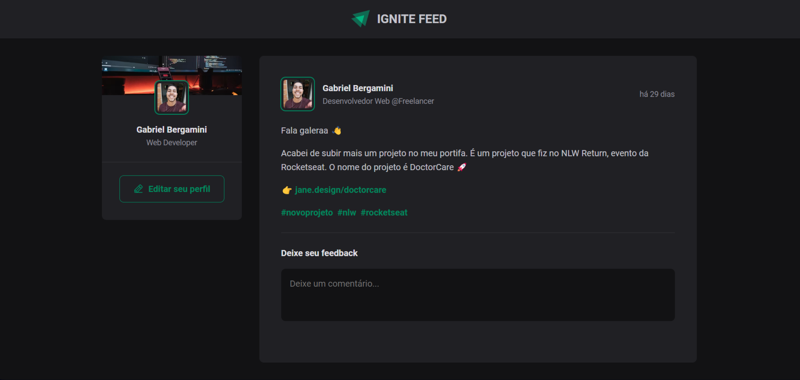
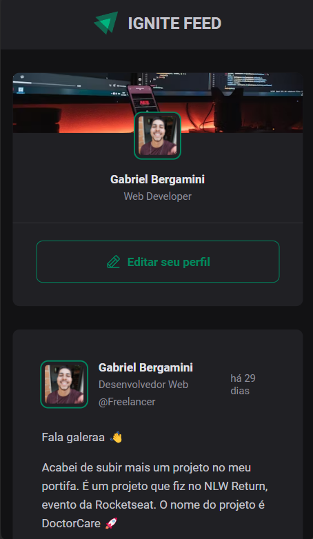

# Ignite Feed

> Status: finished.

### News feed created together with rocketseat, in this project, I made a very good leap forward in relation to reactjs, I learned how to use properties from other components, using props as a parameter or even destructuring properties. I also learned some more css properties too, and learned how to use the css module, and how tags generated with random codes work to be able to use the same class name in other places as well.

### result DeskTop:

    

### result Mobile:

    

## In this project, I used ReactJs, JavaScript, CSS Module, HTML (JSX) and Git .
